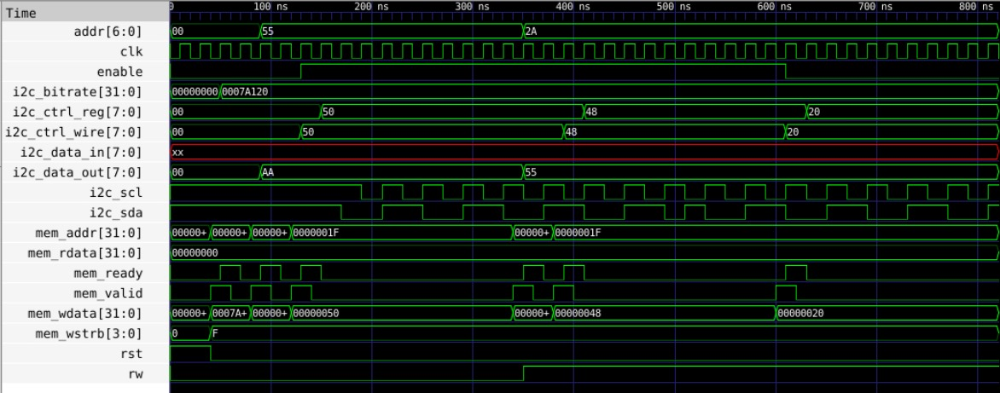
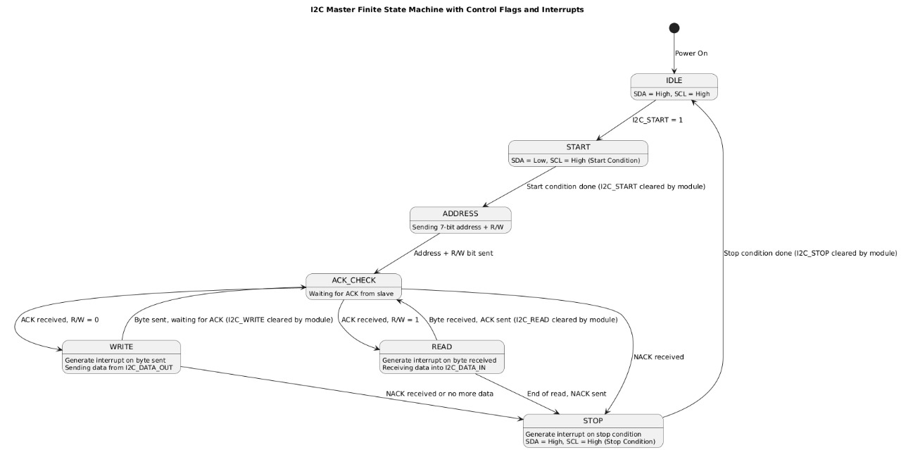
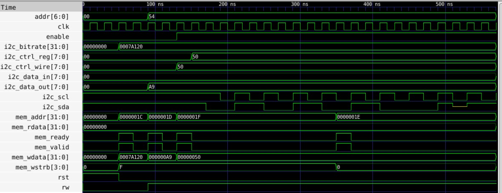

# I2C-PROYECTO

Proyecto I2C, data de configuración y elementos necesarios para poder visualizar el funcionamiento del módulo I2C del procesador RISC-V. Esta es una versión inicial que no comprende el funcionamiento completo  ni totalmente correcto en su totalidad sino más bien una primera aproximación para el desarrollo del módulo.

# I2C Write Module Project

## Propósito del módulo

El módulo diseñado implementa un controlador I2C que soporta operación en modo Maestro/Esclavo para realizar operaciones de escritura. Este módulo genera las señales necesarias para transmitir datos hacia un periférico conectado a través del bus I2C, incluyendo el manejo de condiciones de inicio, parada y control de ACK/NACK.

## Configuración

### Especificaciones del módulo

- **Frecuencia de operación**: 100 kHz (configurable).
- **Modo de operación**: Maestro/Esclavo.
- **Direcciones soportadas**: 7 bits.
- **Funciones**:
  - Generación de condiciones Start/Stop.
  - Transmisión de datos al periférico.
  - Manejo de señales ACK/NACK.
  - Generación de interrupciones al completar la escritura.
  - Configuración de prescaler para control del reloj.

### Configuración de Pines

| Pin   | Dirección | Descripción                           |
| ----- | --------- | ------------------------------------- |
| SDA   | Inout     | Línea de datos seriales.              |
| SCL   | Output    | Línea de reloj serial.                |
| RESET | Input     | Señal de reset del controlador.       |
| INT   | Output    | Señal de interrupción para escritura. |
| CLK   | Input     | Reloj del sistema.                    |
| VDD   | Power     | Alimentación positiva.                |
| GND   | Power     | Conexión a tierra.                    |

## Diagrama de bloques

El diagrama de bloques junto con la máquina de estados no difiere entre lectura y escritura, las imagenes se encuentran disponibles en el otro archivo README.

## Cobertura de la especificación

Se cubrieron las siguientes funcionalidades:

- Operación básica en modo Maestro para escritura.
- Generación de condiciones Start y Stop.
- Transmisión de datos hacia el periférico.
- Gestión de ACK/NACK por parte del periférico.

### Elementos pendientes

- Manejo avanzado de múltiples periféricos en simultáneo.
- Manejo de interrupciones.

## Pantallazos de diagramas de tiempo

El diagrama de tiempo corresponde a una simulación del testbench para el módulo I2C en una operación de escritura. Aquí se detalla cómo las señales se comportan durante la transferencia de datos desde el controlador I2C hacia un periférico conectado al bus. A continuación, se describe el proceso observado:

La simulación comienza con la señal `addr[6:0]`, la cual especifica la dirección del periférico que el maestro I2C intenta acceder. En este caso, la dirección está configurada en `55` (hexadecimal). Esta dirección es esencial para que el periférico conectado reconozca que es el destinatario de la comunicación. La señal de reloj del sistema (`clk`) está activa durante toda la operación, sincronizando las transiciones de todas las señales del controlador. La señal `enable` está habilitada, indicando que el módulo está en funcionamiento.

En el bloque de configuración, el registro `i2c_bitrate[31:0]` establece la frecuencia de operación del bus I2C. El valor configurado (`0007A120` en hexadecimal) corresponde a una frecuencia calculada para cumplir con los estándares de comunicación del protocolo, alrededor de 100 kHz. Los registros `i2c_ctrl_reg[7:0]` y `i2c_ctrl_wire[7:0]` controlan las operaciones del bus I2C, como iniciar la escritura y gestionar las condiciones de inicio y parada. Durante la simulación, los valores de estos registros cambian en momentos clave, pasando de `50` a `48`, lo que refleja comandos específicos para iniciar y procesar la operación de escritura.

En el flujo de datos, se observa que `i2c_data_out[7:0]` contiene el valor `AA` al comienzo de la operación, lo que indica que el controlador está transmitiendo la dirección hacia el periférico. Posteriormente, se envía el valor `55`, lo que confirma la transmisión secuencial de datos. La línea `i2c_scl` (reloj serial) genera pulsos regulares, sincronizando la transferencia de bits en la línea de datos `i2c_sda`. La actividad en `i2c_sda` muestra los cambios correspondientes a los datos transmitidos, siguiendo el protocolo I2C para cada bit enviado.

Por otro lado, las señales asociadas a la memoria (`mem_addr[31:0]`, `mem_rdata[31:0]`, `mem_wdata[31:0]`, `mem_ready`, y `mem_valid`) reflejan la interacción entre el módulo I2C y los registros internos del controlador. La señal `mem_addr` cambia a `0000001F`, indicando la dirección de la memoria que está siendo escrita. Simultáneamente, `mem_wdata[31:0]` presenta valores como `00000050` y `00000048`, que coinciden con los datos enviados al periférico. Las señales `mem_ready` y `mem_valid` trabajan juntas para sincronizar la transferencia, asegurando que los datos sean enviados en el momento adecuado. La señal `mem_wstrb` activa una escritura en la memoria cuando está en `F`, mientras que `rst` permanece inactiva durante esta operación, lo que asegura que el sistema no se reinicie.

El diagrama de tiempo revela varios aspectos que podrían mejorarse o ajustarse en el diseño del módulo I2C para operaciones de escritura. Aunque las señales principales como `i2c_sda`, `i2c_scl` y los registros internos funcionan correctamente, se observan posibles inconsistencias en la sincronización de señales como `mem_ready` y `mem_valid`, lo que podría provocar errores en ciertas condiciones. También sería necesario validar el comportamiento del módulo con múltiples periféricos en el bus, así como probar el ajuste a velocidades estándar como 400 kHz (Fast Mode) para evaluar su versatilidad. Aunque se observan datos transmitidos (`AA` y `55`), no hay un mecanismo que valide la integridad de los datos escritos en el periférico, como una lectura posterior para confirmación. Además, faltan pruebas para escenarios donde el periférico no responde o devuelve un NACK, así como pruebas de transferencias de bloques de datos más grandes. Por último, no se evalúan explícitamente los tiempos de configuración y retención para las señales del bus, lo que podría afectar la conformidad con el protocolo I2C en condiciones específicas. Estas observaciones sugieren la necesidad de pruebas más exhaustivas y posibles ajustes en el diseño para garantizar un comportamiento robusto y confiable.

#INSTRUCCIONES
iverilog -o test top.v i2c_registers.v i2c_controller.v i2c_slave_controller.v top_tb.v
vvp test
gtkwake

# I2C Read Module Project

## Propósito del módulo

El módulo diseñado implementa un controlador I2C completo que soporta operación en modo Maestro/periferico con capacidades de configuración para direcciones de 7 bits y características como manejo de ACK/NACK y detección de condiciones Start/Stop.

## Diagrama de bloques y Máquina de Estados

El diagrama de bloques presentado describe la arquitectura general del módulo I2C, donde se pueden identificar claramente las diferentes secciones que permiten implementar el protocolo de comunicación. En el núcleo del diseño se encuentra el manejo de dos buses principales: el bus de datos y el bus de direcciones. El bus de datos, que incluye señales como `mem_wdata` y `mem_rdata`, se utiliza para transferir información hacia y desde los registros internos del módulo. Por otro lado, el bus de direcciones (`mem_addr`) es el encargado de seleccionar los registros internos específicos para las operaciones de lectura o escritura, lo cual facilita el acceso y configuración del módulo desde un sistema externo.

En la parte central del diagrama, se encuentran los registros internos principales que gestionan las operaciones del módulo I2C. El registro `I2C_BITRATE` es responsable de configurar la frecuencia de operación del bus, ajustándola mediante divisores de reloj que garantizan una velocidad precisa, como los 100 kHz típicos en aplicaciones estándar. El registro `I2C_DATA_OUT` almacena los datos que serán enviados hacia el dispositivo periferico, mientras que el registro `I2C_DATA_IN` almacena los datos que el periferico retorna al maestro durante una operación de lectura. Adicionalmente, el registro `I2C_CTRL` maneja señales clave de control, como la inicialización de las operaciones, la elección del modo (lectura o escritura) y el envío de las condiciones de inicio y parada (START/STOP).

Un componente muy importante del diseño es el controlador de reloj, que se compone de un contador y un divisor. Este subsistema toma el reloj del sistema (`CPU_CLOCK`) y lo ajusta para generar una señal de reloj específica para el bus I2C (`SCL`), que es esencial para sincronizar la comunicación entre maestro y periferico. El controlador de reloj trabaja en conjunto con la máquina secuencial, la cual implementa la lógica necesaria para el manejo del protocolo I2C. Esta máquina se encarga de gestionar las condiciones de inicio y parada, la generación de señales de habilitación (`EN_I2C`), y el control de la línea de datos (`SDA`), además de manejar los flujos de datos y las respuestas ACK/NACK.

En el diseño también se incluyen diversas señales de control y estado que facilitan la comunicación con el entorno externo. Por ejemplo, las señales `mem_valid` y `mem_ready` aseguran la correcta sincronización de las transferencias de datos. Adicionalmente, `mem_wstrb` permite definir si la operación es de escritura (`1`) o lectura (`0`), coordinando el flujo de información con los registros internos.

La máquina de estados finita mostrada describe el funcionamiento del módulo maestro del protocolo I2C. Comienza en el estado **IDLE**, donde tanto la línea de datos (`SDA`) como la línea de reloj (`SCL`) se encuentran en un nivel alto, indicando que el bus está inactivo y listo para comenzar una operación. Una vez que se activa la señal `I2C_START`, el sistema genera una condición de inicio al llevar la línea `SDA` a nivel bajo mientras `SCL` permanece en alto. Esta transición señala a los periféricos conectados que se está iniciando una operación de comunicación.

Después de establecer la condición de inicio, el maestro pasa al estado **ADDRESS**, donde envía la dirección de 7 bits del periférico con el que desea comunicarse, seguida por un bit que indica si la operación será de lectura o escritura. Una vez enviada la dirección y el bit de control, el maestro pasa al estado **ACK_CHECK**, donde espera una respuesta de reconocimiento (`ACK`) por parte del periférico. Si se recibe el `ACK`, el maestro confirma que el periférico ha respondido correctamente y continúa con la operación según el bit de lectura o escritura enviado.

En caso de que el bit de control indique una escritura (`R/W = 0`), el maestro entra al estado **WRITE**. Aquí, envía un byte de datos desde el registro interno `I2C_DATA_OUT` hacia el periférico. Una vez que el byte ha sido enviado, el maestro genera una interrupción para indicar que la operación ha sido completada y regresa al estado de verificación de `ACK` para continuar con la transferencia de datos o finalizar la operación. Si el periférico envía un `NACK`, el maestro detiene la escritura y procede a finalizar la comunicación.

Si el bit de control indica una lectura (`R/W = 1`), el maestro transita al estado **READ**, donde recibe un byte de datos del periférico y lo almacena en el registro interno `I2C_DATA_IN`. Similar al estado de escritura, una vez recibido el byte, el maestro genera una interrupción para indicar que los datos han sido capturados correctamente. Si el periférico envía un `NACK` o no hay más datos disponibles, el maestro termina la operación de lectura y pasa al estado final.

Finalmente, el maestro entra en el estado **STOP** para generar una condición de parada. Esto se logra llevando la línea `SDA` de nivel bajo a nivel alto mientras `SCL` permanece en alto, señalando a los periféricos que la operación de comunicación ha concluido. Una vez completada la condición de parada, el módulo regresa al estado **IDLE**, quedando disponible para iniciar una nueva operación.

## Configuración

### Especificaciones del módulo

- **Frecuencia de operación**: 100 kHz (configurable).
- **Modo de operación**: Maestro/periferico.
- **Direcciones soportadas**: 7 bits.
- **Funciones**:
  - Detección de condiciones Start/Stop.
  - Manejo de ACK/NACK.
  - Configuración del prescaler.

### Configuración de Pines

| Pin   | Dirección | Descripción                     |
| ----- | --------- | ------------------------------- |
| SDA   | Inout     | Línea de datos seriales.        |
| SCL   | Input     | Línea de reloj serial.          |
| RESET | Input     | Señal de reset del controlador. |
| INT   | Output    | Señal de interrupción.          |
| CLK   | Input     | Reloj del sistema.              |
| VDD   | Power     | Alimentación positiva.          |
| GND   | Power     | Conexión a tierra.              |

## Cobertura de la especificación

Se cubrieron las siguientes funcionalidades:

- Operación básica en modo Maestro y periferico.
- Configuración de direcciones de 7 bits.
- Soporte para generación de interrupciones.
- Detección de condiciones Start y Stop.

### Elementos pendientes

- Implementación de direccionamiento de 10 bits.
- Soporte para múltiples perifericos simultáneamente.
- Mejoras en la optimización del tiempo de respuesta.

## Pantallazos de diagramas de tiempo

El diagrama de tiempo presentado corresponde a una prueba de lectura del módulo I2C, donde se evalúa su capacidad para interactuar correctamente con un dispositivo periferico y una memoria asociada. En la señal `addr[6:0]`, se observa que la dirección del periferico está configurada en `54` (hexadecimal), lo cual indica que se intenta establecer comunicación con un dispositivo en esta dirección. La señal de reloj `clk` sincroniza todas las operaciones, mientras que la señal `enable` habilita el funcionamiento del módulo. Estas configuraciones iniciales son fundamentales para iniciar la operación de lectura.

El controlador está configurado mediante los registros `i2c_bitrate[31:0]`, que establece una frecuencia de operación para el bus I2C, y `i2c_ctrl_reg[7:0]` junto con `i2c_ctrl_wire[7:0]`, los cuales estan configurados para una operación de lectura activa, reflejados en el valor `50`. Estas configuraciones sugieren que el controlador emite las señales necesarias para iniciar y mantener la comunicación.

En las señales de datos `i2c_data_out[7:0]` y `i2c_data_in[7:0]`, se puede observar que el módulo I2C envía el dato `A9` al periferico al inicio de la operación. Sin embargo, la señal `i2c_data_in` permanece en `00` durante toda la simulación, lo cual indica que no se reciben datos válidos desde el dispositivo periferico. Este comportamiento podría deberse a que el periferico no está reconociendo correctamente la dirección `54`, o bien a que no está enviando una respuesta adecuada a las señales emitidas por el maestro. Adicionalmente, las señales `i2c_scl` (reloj del bus) y `i2c_sda` (datos del bus) muestran actividad, con `i2c_scl` generando pulsos de reloj como se espera en una operación I2C, pero la ausencia de cambios significativos en `i2c_sda` sugiere una falta de respuesta del periferico.

En cuanto a la interacción con la memoria, las señales `mem_addr[31:0]` y `mem_rdata[31:0]` indican que el módulo intenta leer datos de diferentes direcciones de memoria, pero el valor de `mem_rdata` permanece en `00000000`, indicando que no se obtiene información válida. Este problema podría estar relacionado con la falta de alineación entre las señales `mem_ready` y `mem_valid`, las cuales deben sincronizarse adecuadamente para garantizar la transferencia correcta de datos. Durante la simulación, se observan intentos de comunicación, pero la falta de datos válidos tanto en `i2c_data_in` como en `mem_rdata` refleja una falla en el flujo completo de datos desde el periferico hasta la memoria.

Por último, la señal `rst` activa inicialmente el sistema para garantizar su correcta inicialización, y la señal `rw` indica que el controlador está en modo de lectura, con un valor de `0`. Sin embargo, a pesar de que las señales de control parecen funcionar como se espera, el sistema no logra completar con éxito la operación de lectura debido a problemas de comunicación entre el maestro I2C, el periferico y la memoria. Es necesario verificar la configuración del periferico I2C para asegurar que responde a la dirección configurada, así como revisar las señales de control y sincronización, particularmente `mem_ready` y `mem_valid`, para garantizar un flujo correcto de datos. También sería útil revisar la implementación del protocolo en el periferico y validar si las señales generadas por el maestro cumplen con las especificaciones del protocolo I2C.

## Instrucciones

iverilog -o test top.v i2c_registers.v i2c_controller.v i2c_slave_controller.v top_tb.v

vvp test

gtkwake

## Créditos

Proyecto desarrollado como trabajo final de la asignatura electiva Diseño de Circuitos Integrados del programa de Ingeniería Electrónica de la Universidad del Quindío.

Desarrollado por los estudiantes Daniel Alejandro Cangrejo López, Santiago Alfonso Luna Rueda, Alvaro Sebástian Hernandez Ramirez y Andrea Carolina Soler Ramirez con base en los requerimientos dados por los docentes Iván Marín y Alexander Vera.

Cualquier duda o mejora, ¡no dudes en contribuir! 🚀
